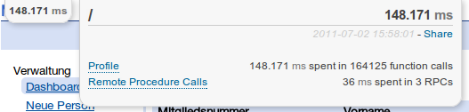

=======================
Flask-GAE-Mini-Profiler
=======================

.. module:: flaskext.gae_mini_profiler

Flask-GAE-Mini-Profiler integrates the excellent
`gae_mini_profiler`_ with your `Flask`_ application on `Google App Engine`_.

.. _Flask: http://flask.pocoo.org/
.. _`Google App Engine`: http://appengine.google.com
.. _gae_mini_profiler: http://bjk5.com/post/6944602865/google-app-engine-mini-profiler

Installation
============

The extension is available at PyPI and can be installed with the ``pip``
command::

   $ pip install Flask-GAE-Mini-Profiler

As package management with Google App Engine can be tricky, it's recommended to
keep your libraries in a seperate folder.

::

   myapp/
      lib/
         flask/
         flaskext/
            __init__.py
            gae_mini_profiler/

The ``__init__.py`` must contain the following line to declare the folder a
namespace::

   __import__('pkg_resources').declare_namespace(__name__)
   

Now all you got to do is make sure that your ``lib`` folder is added to the
Python library path before any packages are imported. Add a snippet like this
before your imports::

   import os
   import sys

   PACKAGE_DIR = os.path.join(
      os.path.dirname(__file__),
      "lib"
   )
   sys.path.insert(0, PACKAGE_DIR)

How to Use
==========

Flask-GAE-Mini-Profiler is very easy to use::

   from flask import Flask
   from flaskext.gae_mini_profiler import GAEMiniProfiler

   app = Flask(__name__)
   GAEMiniProfiler(app)

That's it. Enjoy your profiling stats.

Config
======

There are two configuration options for Flask-GAE-Mini-Profiler:

+--------------------------------+---------------------+----------------------+
| Option Name                    | Default Value       |  Description         |
+--------------------------------+---------------------+----------------------+
| GAEMINIPROFILER_PROFILER_EMAILS| ['test@example.com']|  List of login       |
|                                |                     |  email addresses     |
|                                |                     |  allowed to see the  |
|                                |                     |  profiler.           |
+--------------------------------+---------------------+----------------------+
| GAEMINIPROFILER_PROFILER_ADMINS| True                |  Allow admins to see |
|                                |                     |  the profiler.       |
+--------------------------------+---------------------+----------------------+
